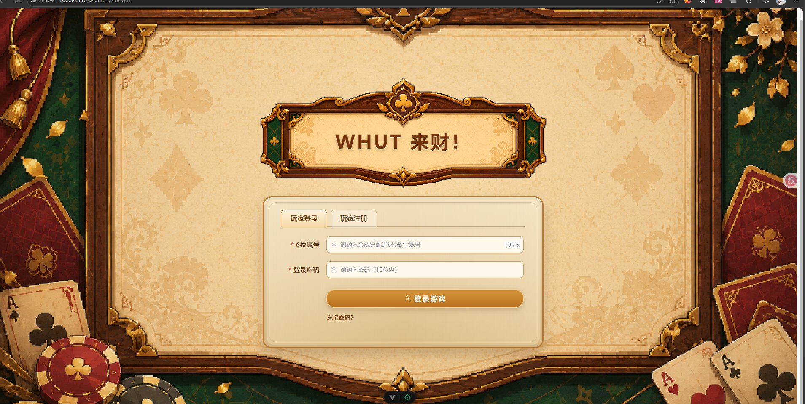
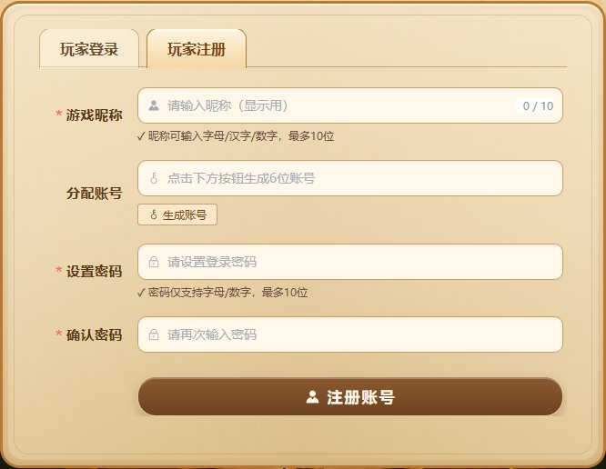
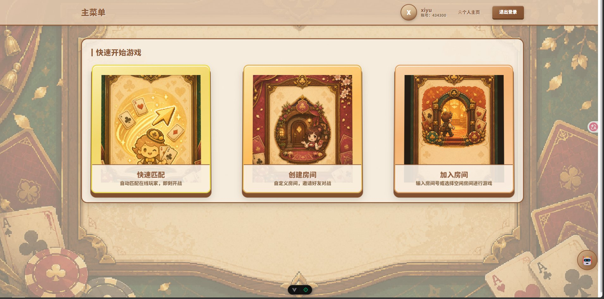
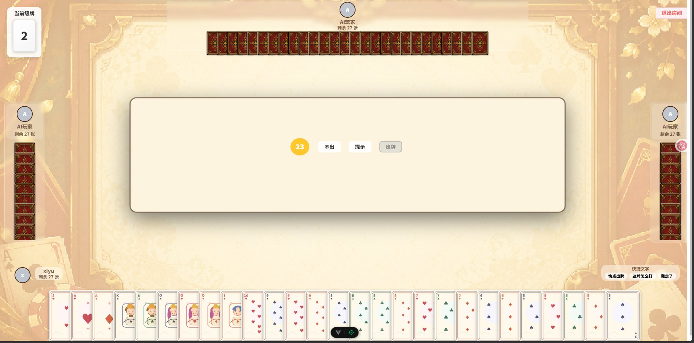
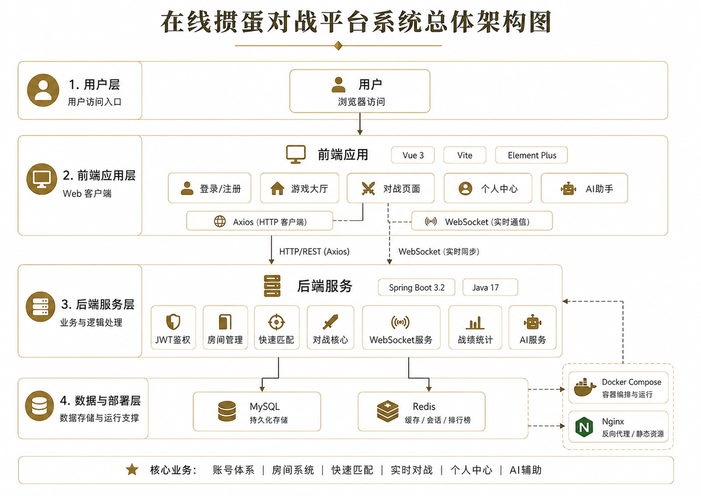
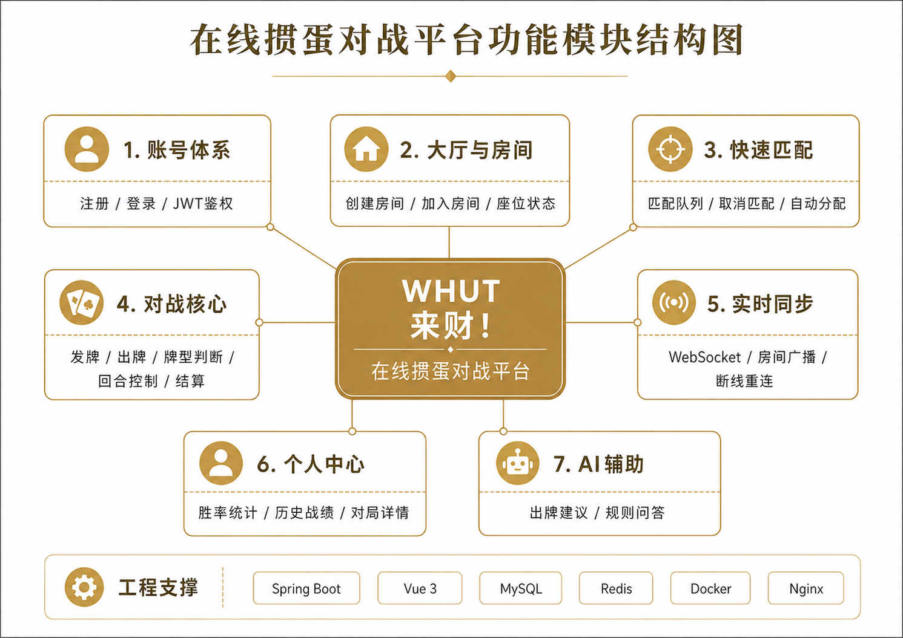
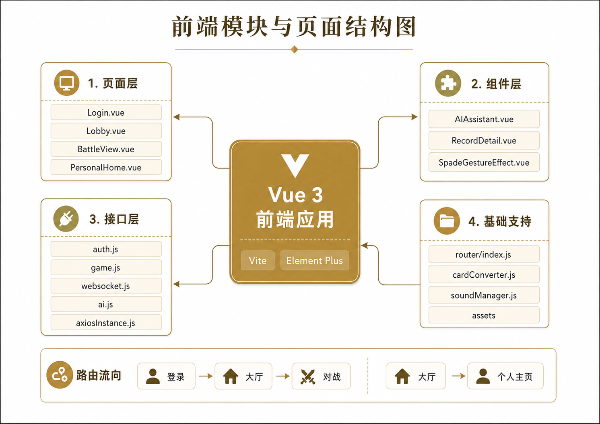
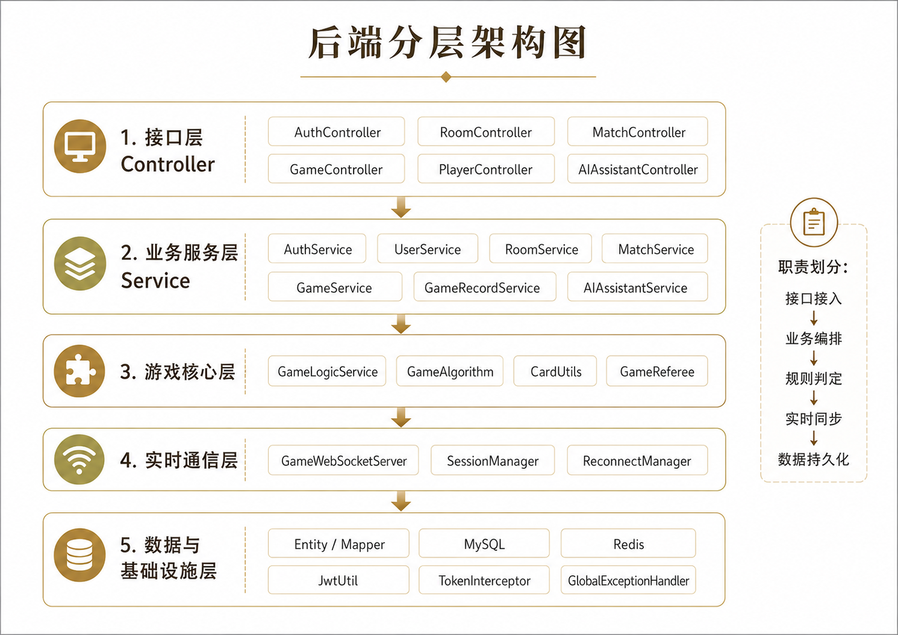
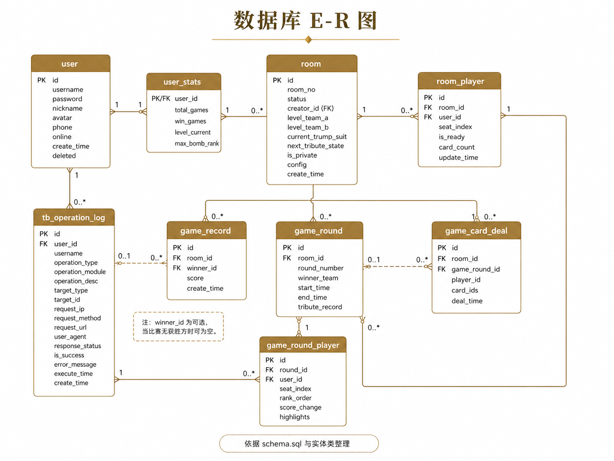
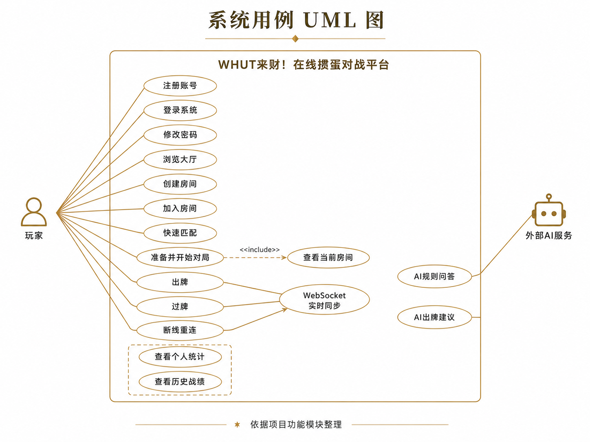

<p align="center">
  
</p>

<h1 align="center">🃏 掼蛋 · 在线卡牌对战平台</h1>

<p align="center">
  <b>武汉理工大学 软件工程实践课程项目</b>
  <br>
  <b>版本 v1.0.0</b> ｜ 已归档 ✅
</p>

<p align="center">
  <a href="#-功能预览">功能预览</a> •
  <a href="#-界面展示">界面展示</a> •
  <a href="#-技术栈">技术栈</a> •
  <a href="#-快速开始">快速开始</a> •
  <a href="#-在线体验">在线体验</a> •
  <a href="#-团队分工">团队分工</a>
</p>

<p align="center">
  
  
  
  
  
  
</p>

---

## 🎮 在线体验

| 入口 | 地址 |
|------|------|
| 🌐 **游戏地址** | [http://106.54.11.102:5173/](http://106.54.11.102:5173/) |
| 📺 **项目演示视频** | [Bilibili — 武理26软工实践在线掼蛋卡牌对战平台](https://www.bilibili.com/video/BV15PjS6rETV/) |

> 💡 推荐使用 Chrome / Edge 浏览器访问，可获得最佳体验。

---

## 📸 界面展示

<div align="center">
  <table>
    <tr>
      <td align="center"><b>🖥 登陆首页</b></td>
      <td align="center"><b>📝 注册页面</b></td>
    </tr>
    <tr>
      <td></td>
      <td></td>
    </tr>
    <tr>
      <td align="center"><b>🏠 游戏首页</b></td>
      <td align="center"><b>⚔️ 对战界面</b></td>
    </tr>
    <tr>
      <td></td>
      <td></td>
    </tr>
  </table>
</div>

## 🏗 设计图纸

<div align="center">
  <table>
    <tr>
      <td align="center"><b>🏛 系统架构图</b></td>
      <td align="center"><b>📦 平台功能模块结构图</b></td>
    </tr>
    <tr>
      <td></td>
      <td></td>
    </tr>
    <tr>
      <td align="center"><b>🎨 前端架构图</b></td>
      <td align="center"><b>🔧 后端分层架构图</b></td>
    </tr>
    <tr>
      <td></td>
      <td></td>
    </tr>
    <tr>
      <td align="center"><b>🗄 数据库 E-R 图</b></td>
      <td align="center"><b>📐 用例 UML 图</b></td>
    </tr>
    <tr>
      <td></td>
      <td></td>
    </tr>
  </table>
</div>

---

## ✨ 功能预览

### 🔐 用户认证
支持账号注册（系统分配 6 位数字账号）和密码登录，集成 **JWT Token** 认证、Token 刷新和密码重置功能。前端提供表单校验和友好的错误提示，后端采用 **BCrypt** 加密存储密码。支持「记住密码」持久化到 localStorage。

### 🏠 房间管理
创建房间自动生成唯一 6 位房间号，支持加入 / 退出房间、房主解散 / 踢出玩家、转移房主权限。房间满 4 人锁定，游戏开始后不可加入。房间号一键复制，大厅列表实时刷新。

### ⚔️ 游戏对战
四人掼蛋经典玩法，支持玩家准备 / 取消准备、回合制出牌、**WebSocket** 实时状态同步。每轮 30 秒倒计时，超时自动过牌。内置 AI 出牌推荐引擎、牌型自学习权重调整、出牌动画系统。支持观战模式和游戏回放。

### 🔄 匹配服务
快速匹配队列，满 4 人自动创建房间并通知所有玩家。支持取消匹配，轮询超时 60 秒自动提示重试。断线重连自动恢复房间状态。

### 📊 个人中心
战绩详情展示、胜率统计与时间 / 结果筛选、连胜 / 连败趋势分析。支持战绩导出为 JSON / CSV 格式。

---

## 🏗 项目架构

```
┌───────────────────────────────────────────────────────────────┐
│                    前端 (Vue 3 + Vite)                        │
│  ┌──────────┐ ┌──────────┐ ┌──────────┐ ┌──────────┐        │
│  │ 登录/注册 │ │  游戏大厅 │ │  个人中心 │ │  游戏桌   │        │
│  └────┬─────┘ └────┬─────┘ └────┬─────┘ └────┬─────┘        │
│       │            │            │            │               │
│  ┌────┴────────────┴────────────┴────────────┴────┐          │
│  │            Axios / WebSocket                    │          │
│  └────────────────────┬───────────────────────────┘          │
└───────────────────────┼─────────────────────────────────────┘
                        │
┌───────────────────────┼─────────────────────────────────────┐
│                Nginx 反向代理                                │
│          ┌────────────┴────────────┐                         │
│          │  HTTPS + HTTP/2        │                         │
│          │  限流 30r/s + 安全头    │                         │
│          └────────────┬────────────┘                         │
└───────────────────────┼─────────────────────────────────────┘
                        │
┌───────────────────────┼─────────────────────────────────────┐
│                后端 (Spring Boot 3.1.5)                      │
│  ┌──────────┐ ┌──────────┐ ┌──────────┐ ┌──────────┐        │
│  │ 认证模块  │ │ 房间管理  │ │ 游戏引擎  │ │ 匹配服务  │        │
│  │ JWT/Token │ │ CRUD操作 │ │ 出牌逻辑 │ │  队列    │        │
│  └────┬─────┘ └────┬─────┘ └────┬─────┘ └────┬─────┘        │
│       │            │            │            │               │
│  ┌────┴────────────┴────────────┴────────────┴────┐          │
│  │         MyBatis Plus / WebSocket               │          │
│  └────────────────────┬───────────────────────────┘          │
└───────────────────────┼─────────────────────────────────────┘
                        │
┌───────────────────────┼─────────────────────────────────────┐
│          ┌────────────┴────────────┐                          │
│          │         MySQL           │                          │
│          │  用户表 / 房间表 / 游戏记录│                         │
│          └─────────────────────────┘                          │
└───────────────────────────────────────────────────────────────┘
```

---

## 🛠 技术栈

### 后端

| 技术 | 版本 | 用途 |
|------|------|------|
| Java | 17 | 开发语言 |
| Spring Boot | 3.1.5 | 应用框架 |
| MyBatis Plus | 3.5.4 | ORM 框架 |
| MySQL | 8.0 | 数据库 |
| WebSocket | — | 实时通信 |
| JWT | 0.12 | 身份认证 |
| BCrypt | — | 密码加密 |
| Docker | 24.0 | 容器化部署 |
| Nginx | 1.24 | 反向代理 + 限流 |

### 前端

| 技术 | 版本 | 用途 |
|------|------|------|
| Vue 3 | 3.4 | 前端框架 |
| Vite | 5.0 | 构建工具 |
| Element Plus | 2.5 | UI 组件库 |
| Axios | 1.6 | HTTP 客户端 |
| Pinia | 2.1 | 状态管理 |
| WebSocket | — | 实时通信 |

---

## 🚀 快速开始

### 环境要求
- JDK 17+、Node.js 18+、MySQL 8.0+

```bash
# 1. 克隆项目
git clone https://github.com/wutcst/kai-fa-promax.git
cd kai-fa-promax

# 2. 初始化数据库
mysql -u root -p -e "CREATE DATABASE IF NOT EXISTS guandan_game DEFAULT CHARACTER SET utf8mb4;"
mysql -u root -p guandan_game < backend/src/main/resources/schema.sql

# 3. 启动后端
cd backend
mvn clean install -DskipTests
mvn spring-boot:run
# → http://localhost:8080

# 4. 启动前端（新终端）
cd frontend
npm install
npm run dev
# → http://localhost:5173
```

### Docker 一键部署
```bash
docker compose up -d
```

---

## 👥 团队分工

| 成员 | 角色 | 主要负责 |
|------|------|----------|
| **杨丝婳** | 项目负责人 / 全栈开发 | 系统架构设计、后端核心开发、游戏引擎实现、WebSocket 通信、文档管理、CI/CD 流水线、Docker 部署 |
| **陈懋任** | 前端开发 / 部署运维 | 前端页面开发（登录 / 大厅 / 对战 / 个人中心）、前端 API 对接与状态管理、UI/UX 设计与优化、服务器部署与维护、Nginx 配置与安全加固 |
| **王玉珏** | 全栈开发 / 测试 | 后端服务开发（房间管理 / 匹配 / 战绩）、单元测试与回归验证、前端联调与接口测试 |
| **何涛** | 后端开发 | 认证模块开发、房间与匹配模块、游戏逻辑与牌型算法、WebSocket 连接管理 |
| **xiyu1296** | 部署运维 / 文档 | 服务器部署与环境配置、README 与文档维护、协同开发报告汇总 |

---

## 📅 开发历程

```
Phase 1 基础功能 (05/12 - 05/20)
  ├── 用户认证系统（注册/登录/Token/BCrypt）
  ├── 房间管理（创建/加入/退出/解散）
  ├── 游戏对战引擎（出牌/回合/WebSocket）
  └── 前端页面（登录/大厅/个人中心/游戏桌）

Phase 2 阶段提升 (05/21 - 06/07)
  ├── Docker 一键部署 + Nginx 反向代理
  ├── WebSocket 连接管理与心跳检测
  ├── CI/CD 自动发布流水线
  ├── 统一错误码体系与国际化
  └── 文档完善与测试补充

Phase 3 增强特性 (06/07 - 06/12)
  ├── 密码重置流程（邮箱验证码 + 限时 Token）
  ├── 游戏回放记录与分段查询
  ├── RateLimit API 限流防刷
  ├── Docker 多阶段构建优化 + 健康检查
  └── 密码重置 / 观战模式 / AI 出牌推荐

Phase 4 最终归档 (06/12 - 06/20)
  ├── Nginx HSTS 安全加固
  ├── 全量文档整理
  ├── 协同开发报告归档
  └── 项目代码冻结
```

---

## 📋 版本历史

| 版本 | 日期 | 主要内容 |
|------|------|----------|
| v1.0.0 | 2026-05-20 | 基础功能：用户认证、房间管理、游戏对战引擎、WebSocket 通信 |
| v1.1.0 | 2026-06-07 | Docker 部署、Nginx 安全配置、CI/CD 流水线、文档完善 |
| v1.2.0 | 2026-06-12 | 密码重置、游戏回放、观战模式、AI 出牌推荐、API 限流 |
| v1.0.0-rc | 2026-06-20 | 最终归档、全量文档整理、协同开发报告 |

---

## 📄 许可证

本项目仅供教育学习使用。

<p align="center">
  <sub>武汉理工大学 软件工程实践课程项目 · 2026</sub>
</p>
